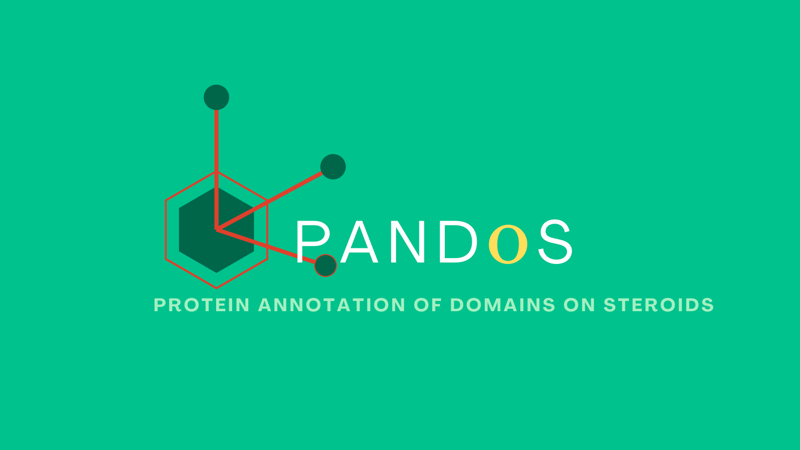

# PANDOS

is a novel resource for structural bioinformatics researchers’ that compiles non-uniform protein domain information from many sources into a new, standardized format.

<!-- demo video -->
<div align="center">
  
  
</div>

The app is still in it's [alpha release](http://titin.abrol.csun.edu/pandos/), as more data needs to be processed and entered into the database. However, the app is functional from a technology standpoint.

## What is the problem?

The currently available information on membrane protein domains is scattered over different platforms and is mainly focussed towards the transmembrane (TM) domains. In order to compare the same domain between proteins or to compare different domains within a protein, a standard is needed.


## The solution:

A web-based searchable database containing membrane fasta (mfta) files enriched with topological features. All one needs to do is enter a protein's Uniprot ID or a protein complex's PDB ID and the app outputs all of the consensus protein chain information associated with the protein ID.


## Implementation details 
The front end is a SPA that queries the backend using \$HTTP service calls as well as custom components and *ngFor/*ngIf directives to dynamically display data.
<br><br>
The backend is a simple CRUD API.


## Tech stack

|                            | Front end                        |                       Back end                       |                               Database |
| -------------------------- | :------------------------------- | :--------------------------------------------------: | -------------------------------------: |
| Languages/<br />Frameworks | Angular 12, Material-UI          | C#, .NET Entity Framework, Object Relational Mapping |                     Azure SQL Database |
| Software                   | VS Code, Webstorm                |         Visual Studio, Swagger, Postman              | Sequel Studio Management Server (SSMS) |
| Deployment method          | Self hosted remote Apache server |                  Azure App Services                  |                   Azure Cloud Database |


# Running instructions

These instructions assume a few things:
* that you are developing on a windows system 
* have [node version manager](https://github.com/nvm-sh/nvm) installed, and 
* have a local SQL database for development.

<br><br>
Navigate to parent dir and clone repo


```bash
git clone https://github.com/dmw01/pandos-dotnet.git;
cd pandos-dotnet;
```

Install dependancies

```bash
nvm install lts;
npm install dotnet;
dotnet tool install --global dotnet-ef;
```

Create appsettings.json file
```bash
touch appsettings.json;
nano appsettings.json
```

Paste in the following code with your own local database credentials
``` json
{
  "ConnectionStrings": {
    "DefaultConnection": "Server=<your_server_name_here>,<server_port>;Database=<database_name>;User ID=<username_credentials>;Password=<credentials_password>;Encrypt=true;Connection Timeout=30;"

  },
  "Logging": {
    "LogLevel": {
      "Default": "Information",
      "Microsoft.AspNetCore": "Warning"
    }
  },
  "AllowedHosts": "*"
}
```

Migrate data/tables using code first migration

```bash
cd PandosAPI/PandosAPI;
dotnet ef migrations add InitialCreate --context pandosContext;
dotnet ef database update --context pandosContext;
```

Run pandos backend executible (windows required) 

```bash
cd bin/Release/net6.0;
dotnet run PandosAPI.dll; 
```

Navigate to client app

```bash
cd ../../../bin/../../..;
cd PandosClient
```

Install dependancies

```bash
npm install; 
npm install --save @angular/cli;
```

Start frontend

```bash
ng serve
```


## Credits

* [David Macoto Ward](https://dmw01.github.io/), (Sole Fullstack developer) California State University, Northridge, USA
* [Ravi Abrol](http://abrollab.org), (Domain specialist) California State University, Northridge, USA
* [Sayane Shome](https://github.com/sayaneshome), (Domain specialist, logo designer) Stanford, USA
* [Charlotte Adams](https://github.com/adamscharlotte), (Contributing writer, domain specialist) University of Antwerp, Belgium, <charlotte.adams@uantwerpen.be>


The idea is the brainchild of Dr. Ravinder Abrol and was the idea has been developing at the [2020](https://github.com/hackathonismb/Creation-of-a-Membrane-Protein-Extended-Topology-Standard) & [2021](https://github.com/hackathonismb/Membrane-Protein-Domains-Motifs-Annotations) Intelligent Systems for Molecular Biology (ismb) conference's hackathons.
